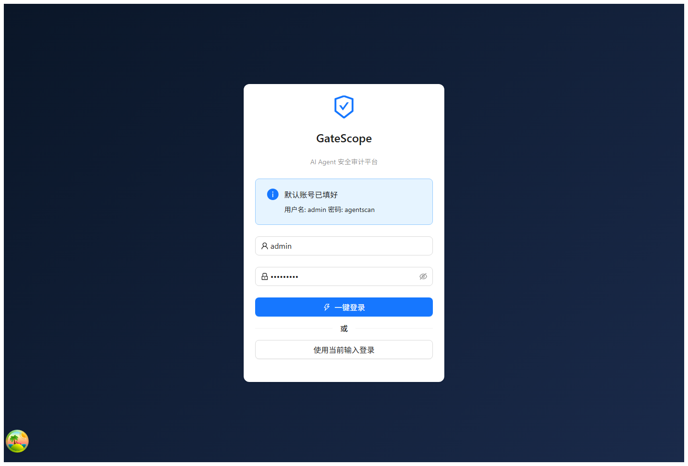
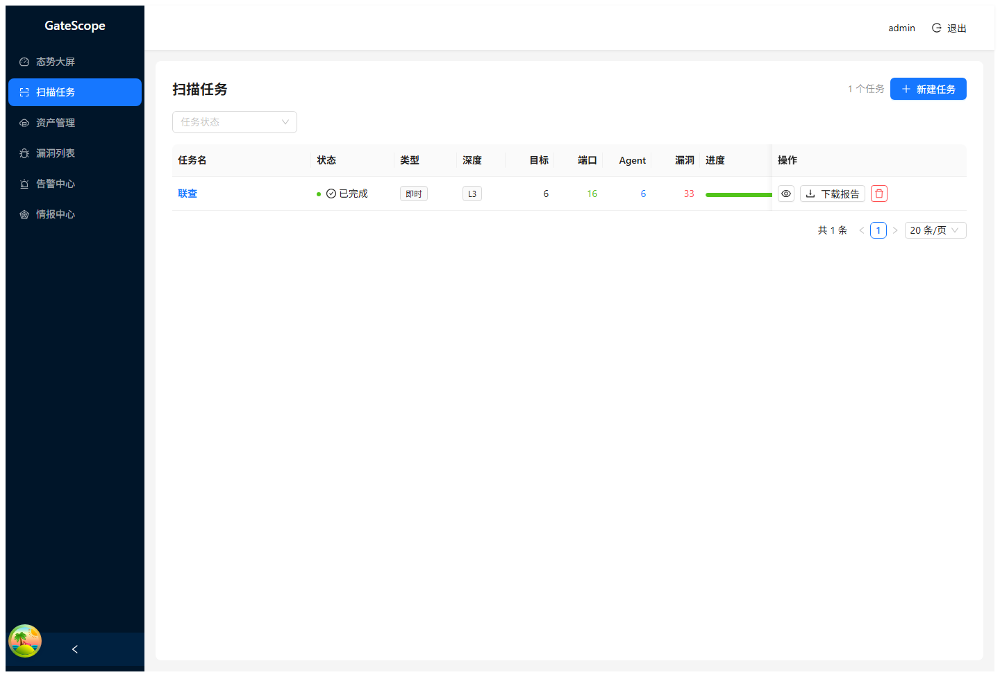
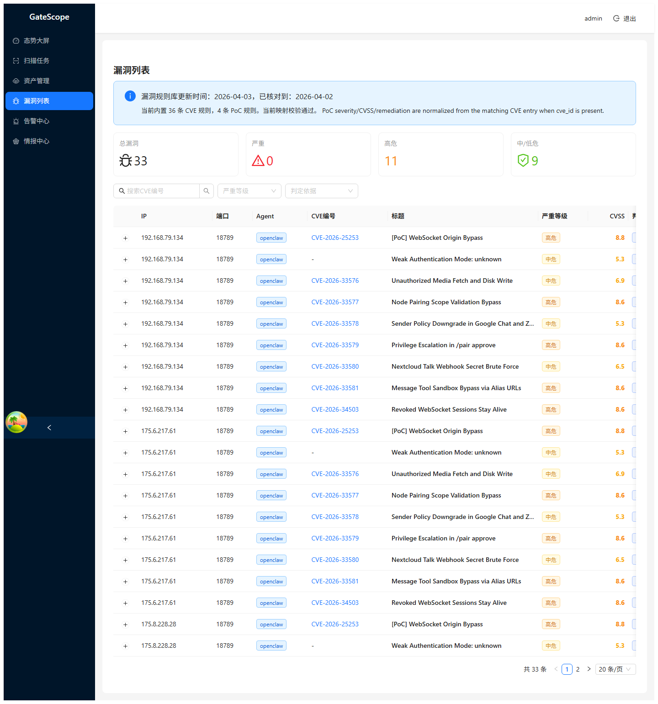

# GateScope

[English](README.en.md)

独立维护的 AI Agent 暴露面发现与漏洞审计项目，基于 `AutoScan/agentscan` 做了面向实战落地的一轮增强，而不是简单换名。

当前维护仓库：
- `https://github.com/FoLaJJ/GateScope`

上游原仓库：
- `https://github.com/AutoScan/agentscan`

许可证：
- `MIT`

归属和衍生说明：
- 见 [NOTICE](NOTICE)

## 这次 fork 主要改了什么

- 增加一站式控制脚本 `./agentscanctl`，统一安装、构建、启动、停止、重启、状态、日志、环境检查、数据库备份、清理、重置。
- 保留 `./gatescopectl` 作为别名包装，但文档默认以 `agentscanctl` 为主。
- 修复前端 `/index.html` 持续 `301` 跳转的问题。
- 登录页默认回填账号密码，网页端可直接一键登录。
- 扫描任务事件改为可持久化和历史回放，任务结束后不再出现“事件为 0”的空白体验。
- 网页端任务详情和漏洞页补充 IP、端口、Agent 类型、版本、认证方式、证据详情，直接能看到“哪个 IP 有哪个漏洞”。
- Excel 导出补全漏洞与资产归属，并保留更完整的证据字段。
- OpenClaw 漏洞库改为纯 YAML 外置维护，程序仅负责加载、校验和展示，便于后续持续新增。
- 相同资产下同一 CVE 会先跑 PoC 实证，再用版本规则补充未被 PoC 命中的条目。
- 页面中增加规则库元数据，能直接看到漏洞库截止日期和规则规模。
- 版本规则补充 `GHSA/CNNVD` 外部编号字段，漏洞详情、任务详情和 Excel 导出可直接看到关联编号。
- 版本规则与漏洞结果补充 `description_zh` 中文描述字段，页面与导出同时展示中英文说明。

## OpenClaw 规则库状态

- 当前规则更新时间：`2026-04-03`
- 上游核对截止：`2026-04-03`
- 当前 OpenClaw 版本规则：`176`
- 当前其中 CVE 规则：`167`
- 当前其中 GHSA 规则：`9`
- 当前其中 CNNVD 规则：`161`（已合并 155 条 2026 年 3 月 CNNVD OpenClaw 批量映射，并保留此前已核实的历史映射）
- 当前本地 PoC 规则：`4`
- 相比上游当前内置的 `7` 条 OpenClaw CVE，当前 fork 已扩展到 `176` 条版本规则，净增 `169` 条

当前版本规则严重等级分布：
- `critical`: `16`
- `high`: `62`
- `medium`: `84`
- `low`: `14`

规则文件位置：
- `configs/rules/openclaw-cves.yaml`
- `configs/rules/openclaw-id-mappings.yaml`
- `configs/rules/pocs.yaml`
- `configs/rules/skills.yaml`

规则判断原则：
- 先执行 PoC 实证命中，保证高置信度漏洞优先落库
- 仅对未被 PoC 命中的漏洞再使用版本号补充
- PoC 规则带 `cve_id` 时，会继承对应 CVE 的严重等级、CVSS 和修复建议，避免同一漏洞多套口径
- 所有版本规则均从 `configs/rules/openclaw-cves.yaml` 加载，新增/修订规则无需改 Go 代码
- 多编号别名从 `configs/rules/openclaw-id-mappings.yaml` 合并；同一漏洞若同时存在 `CVE/CNNVD/GHSA`，页面和导出会一起渲染
- 规则条目新增 `description_zh` 字段；旧漏洞记录在读取时也会按当前规则自动补齐中文描述
- 已合并的 CNNVD 映射已扩展为 155 条 OpenClaw 批量清单，并保留先前补录的历史映射；后续新增编号继续只需维护 `configs/rules/openclaw-id-mappings.yaml`

## 页面展示

## 本次新增的官方漏洞

- 在原有 `9` 条 `GHSA` 官方规则基础上，本轮继续补齐 `131` 条基于 `NVD + CNNVD OpenClaw 批量清单` 的版本规则，重点覆盖 `CVE-2026-320xx`、`CVE-2026-329xx`、`CVE-2026-221xx`、`CVE-2026-275xx`、`CVE-2026-328xx`、`CVE-2026-345xx` 等批次。
- 新增批次里包含大量此前页面完全看不到的 `访问控制错误`、`路径遍历`、`操作系统命令注入`、`代码问题`、`信息泄露`、`日志信息泄露`、`跨站脚本`、`参数注入`、`后置链接`、`竞争条件问题` 漏洞。
- 这批规则全部走 `configs/rules/openclaw-cves.yaml + configs/rules/openclaw-id-mappings.yaml` 外置维护，不再把 CNNVD/CVE 映射写死在程序里。

- `GHSA-846p-hgpv-vphc`：QQ Bot 结构化载荷可触发非预期 mention/card 动作，修复版本 `>= 2026.4.2`
- `GHSA-m34q-h93w-vg5x`：Slack 提取流程可能回退到未鉴权文件抓取，修复版本 `>= 2026.4.2`
- `GHSA-98ch-45wp-ch47`：消息工具 alias URL 的图片链接可能暴露本地文件，修复版本 `>= 2026.4.2`
- `GHSA-2f7j-h9x4-jh34`：大量用户会话可在启动阶段触发无界内存分配，修复版本 `>= 2026.4.2`
- `GHSA-2qrv-rc5x-2g2h`：WhatsApp bridge 可能信任伪造 quoted stanza 字段，修复版本 `>= 2026.4.2`
- `GHSA-5hff-46vh-rxmw`：iOS bridge 在未重新校验发送者信任前接受附件下载，修复版本 `>= 2026.4.2`
- `GHSA-9jpj-p5w9-9rfc`：shared-secret 鉴权存在时序差异泄露，修复版本 `>= 2026.4.2`
- `GHSA-4p4f-fc8q-84m3`：关闭 webhook 鉴权时邮件流水线仍可能调用 SMTP，修复版本 `>= 2026.4.2`
- `GHSA-jj6q-rrrf-h66h`：Telegram 发送者 allowlist 可能解析动态用户名，修复版本 `>= 2026.4.2`

## 这次实现还改了什么

- 漏洞规则从“代码内置兜底”改成“YAML 唯一事实源”，避免以后每次补规则都改程序
- 新增 131 条基于 NVD OpenClaw 记录生成的版本规则，当前规则库总量提升到 176 条
- `configs/rules/openclaw-id-mappings.yaml` 已合并 155 条 CNNVD 批量映射，页面和导出可直接渲染多编号
- 规则 schema 扩展出 `CNNVD/GHSA` 字段，PoC 命中时也会继承对应外部编号
- 176 条 OpenClaw 版本规则已全部补齐 `description_zh`，漏洞详情页、任务详情页和 Excel 报告会同时展示中英文描述
- 漏洞列表、任务详情、Dashboard 最近漏洞、Excel 报告都能展示 `CVE/CNNVD/GHSA`
- 规则元数据新增总规则数、`CVE/CNNVD/GHSA/PoC` 分项统计
- 漏洞页新增编号类型选择，可按 `CVE/CNNVD/GHSA` 精确筛选
- 修复 SQLite 并发写入导致的“任务统计有 Agent，但 `assets` 表少记录”问题；SQLite 模式现在强制单连接、`busy_timeout` 和 `WAL`
- 新增资产持久化保护：`UpsertAsset` 命中旧资产时会回写真实资产 ID，漏洞入库前会同步重映射，避免产生孤儿漏洞
- 新增 `007` 数据修复迁移：会从 `task_events` 的 `agent.identified` 事件里自动回填历史漏写资产，并把原来失联的漏洞重新挂回资产

登录页：



扫描任务页：



漏洞列表页：



## 一键运行

1. 克隆仓库

```bash
git clone https://github.com/FoLaJJ/GateScope.git
cd GateScope
```

2. 准备配置

```bash
cp configs/config.yaml.example _data/config.yaml
```

3. 一站式控制

```bash
./agentscanctl install
./agentscanctl start
./agentscanctl status
./agentscanctl logs --lines 200
./agentscanctl stop
```

常用附加动作：

```bash
./agentscanctl restart
./agentscanctl backup-db
./agentscanctl cleanup-db
./agentscanctl reset-db
./agentscanctl doctor
./agentscanctl env
```

别名入口：

```bash
./gatescopectl start
```

默认登录信息：
- 用户名：`admin`
- 密码：`agentscan`

## 目录重点

- `agentscanctl`: 一站式运维入口
- `gatescopectl`: 对外别名入口
- `configs/rules/`: OpenClaw 规则库
- `internal/`: 后端核心逻辑
- `web/`: 前端页面
- `docs/screenshots/`: README 展示图

## 兼容性说明

- 当前版本内部 Go module/import path 仍保留 `github.com/AutoScan/agentscan`
- 这是有意保留的兼容策略，用来避免一次性大改带来的额外风险
- 对外发布名、README、界面文案和交付方式已经按独立项目维护
