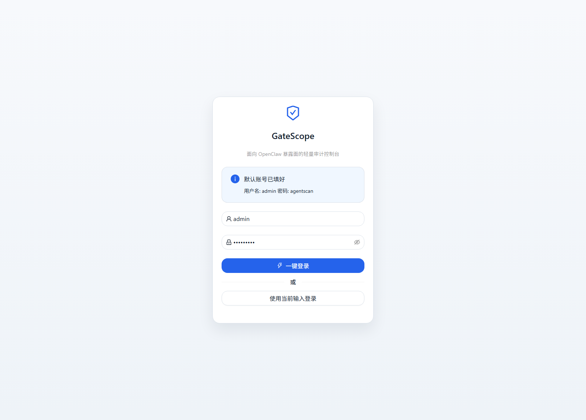
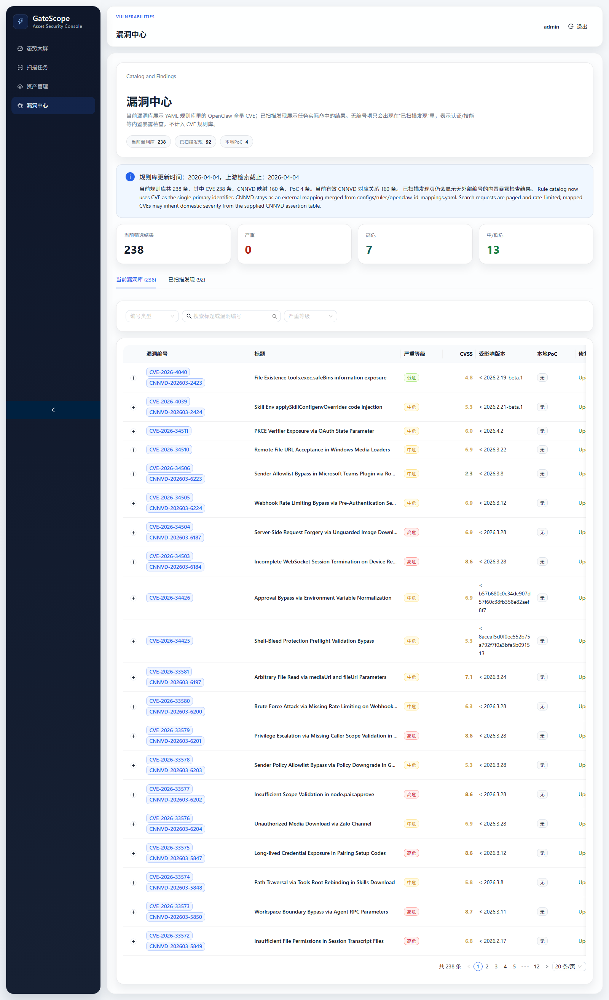
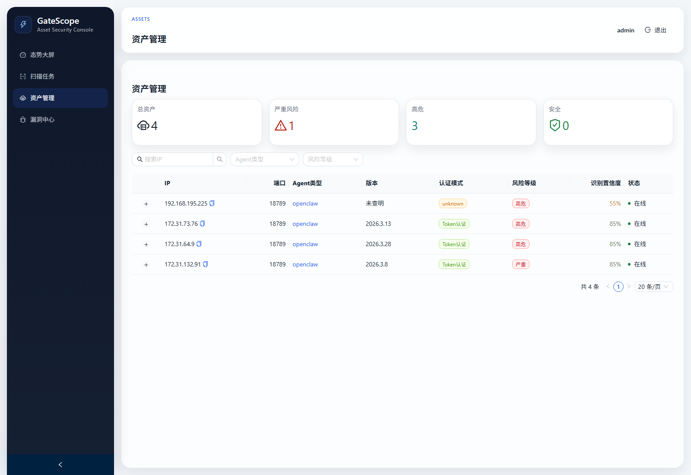

# ClawScan

[English](README.en.md)

独立维护的 AI Agent 暴露面发现与漏洞审计项目，基于 `AutoScan/agentscan` 做了面向实战落地的一轮增强，而不是简单换名。

当前这条 fork 已经不再追求“通用 Agent 扫描平台”的宽口径，而是明显转向 `OpenClaw` 的定向增强检测：
- 规则库、PoC、编号映射、标题校准、中文描述、漏洞库展示与导出链路都优先围绕 `OpenClaw`
- 页面、报告和任务详情中的信息组织也按 `OpenClaw` 暴露面排查与漏洞研判场景重新收敛
- 因此它和上游项目在维护方向、规则规模、展示逻辑、交付方式上已经有比较大的差异

当前维护仓库：
- `https://github.com/FoLaJJ/ClawScan`

上游原仓库：
- `https://github.com/AutoScan/agentscan`

许可证：
- `MIT`

归属和衍生说明：
- 见 [NOTICE](NOTICE)
- 文档入口当前只保留两份主文件：中文 `README.md` 与英文 `README.en.md`

## 本次更改

- 增加一站式控制脚本 `./agentscanctl`，统一安装、构建、启动、停止、重启、状态、日志、环境检查、数据库备份、清理、重置。
- 删除 `./gatescopectl` 别名脚本、Docker 相关交付文件和 `Makefile`，当前仓库只保留 `agentscanctl + Go/Node` 本地构建这一条维护路径。
- 继续收缩仓库结构，删除未再参与现网链路的 `cmd/mock-openclaw`、旧 shell 包装脚本、失效 `.gitmodules` 和旧版 README 截图残留，避免维护入口分散。
- 修复前端 `/index.html` 持续 `301` 跳转的问题。
- 登录页默认回填账号密码，网页端可直接一键登录。
- 当前维护流程改为“本地仓库作为唯一版本源，虚拟机只做运行验证、页面联调和部署验证”，避免把测试环境误当主线版本。
- 扫描任务事件改为可持久化和历史回放，任务结束后不再出现“事件为 0”的空白体验。
- 网页端任务详情和漏洞页补充 IP、端口、Agent 类型、版本、认证方式、证据详情，直接能看到“哪个 IP 有哪个漏洞”。
- Excel 导出补全漏洞与资产归属，并保留更完整的证据字段。
- OpenClaw 漏洞库改为纯 YAML 外置维护，程序仅负责加载、校验和展示，便于后续持续新增。
- 相同资产下同一 CVE 会先跑 PoC 实证，再用版本规则补充未被 PoC 命中的条目。
- 页面中增加规则库元数据，能直接看到漏洞库截止日期和规则规模。
- 版本规则现统一收敛为 `CVE + CNNVD` 两类外部编号，漏洞详情、任务详情和 Excel 导出只展示这两类可核实标号。
- 版本规则与漏洞结果补充 `description_zh` 中文描述字段，页面与导出同时展示中英文说明。
- 漏洞规则从“代码内置兜底”改成“YAML 唯一事实源”，避免以后每次补规则都改程序。
- OpenClaw CVE 规则库现已同步到 `238` 条官方 CVE 规则，并通过 `configs/rules/openclaw-id-mappings.yaml` 维护 `160` 条有效 CNNVD 映射。
- `configs/rules/openclaw-id-mappings.yaml` 的核对基线来自你提供的 `155` 条 CNNVD 对照断言；其中 `2` 条因对应 CVE 已在官方记录中变为 `REJECTED`，现仅保留为失效断言，不再算入有效映射。
- 规则 schema 保留 `CVE/CNNVD` 字段，PoC 命中时也会继承对应外部编号。
- `238` 条 OpenClaw CVE 规则已全部补齐 `description_zh`，漏洞详情页、任务详情页和 Excel 报告会同时展示中英文描述。
- 新增 `scripts/sync_openclaw_cve_catalog.py`，会分页、串行、限速访问 `cve.org` 官方搜索接口，自动同步 OpenClaw CVE 清单并刷新规则库。
- 保留 `scripts/normalize_openclaw_catalog.py`，用于继续校准标题、中文描述和规则字段口径。
- 保留 `scripts/verify_cnnvd_markdown_assertions.py`，可直接对照 `CNNVD网页漏洞对照-4-3版本.md` 校验 `CVE/CNNVD` 是否一一对应。
- 保留 `scripts/verify_openclaw_poc_mappings.py`，可直接对照本地主 YAML 规则库校验 `3` 条带 `CVE` 的 PoC 规则关联的 `CVE/CNNVD/严重等级/CVSS/修复版本` 是否一致。
- 保留 `scripts/repair_vulnerability_catalog.py`，可按当前 YAML 规则库批量修复数据库内历史漏洞记录的 `CVE/CNNVD/标题/等级/中文描述`。
- 漏洞列表、任务详情、Dashboard 最近漏洞、Excel 报告都展示 `CVE/CNNVD`，并移除了 `GHSA` 的筛选、统计和展示链路。
- 规则元数据新增总规则数、`CVE/CNNVD/PoC` 分项统计。
- 漏洞页新增编号类型选择，可按 `CVE/CNNVD` 精确筛选。
- 漏洞中心拆成 `当前漏洞库` 与 `已扫描发现` 两套视图，前者展示 YAML 规则库全量条目，后者展示任务实际命中的漏洞结果。
- 页面、任务详情、资产列表与 Excel 导出已统一空值口径；探测不到版本、认证、编号或证据时会显示明确状态文案，而不是空白或 `-`。
- 修复 SQLite 并发写入导致的“任务统计有 Agent，但 `assets` 表少记录”问题；SQLite 模式现在强制单连接、`busy_timeout` 和 `WAL`。
- 新增资产持久化保护：`UpsertAsset` 命中旧资产时会回写真实资产 ID，漏洞入库前会同步重映射，避免产生孤儿漏洞。
- 新增 `007` 数据修复迁移：会从 `task_events` 的 `agent.identified` 事件里自动回填历史漏写资产，并把原来失联的漏洞重新挂回资产。
- 前端导航收敛为 `态势大屏 / 扫描任务 / 资产管理 / 漏洞清单` 四个主视图，移除告警中心和情报中心，页面结构更直接。
- 新增 `web/public/favicon.svg`，浏览器标签页会显示 ClawScan 的站点图标。
- `agentscanctl` 的 `status/start/stop/reset-db` 不再只信任当前目录的 PID 文件；会额外识别目标端口上的 `agentscan server` 进程，能区分“本 checkout 管理实例”和“其他 checkout 启动的实例”。
- 后端启动时会先执行中断任务恢复和历史资产风险回算；异常退出留下的运行中任务会被自动标记为中断取消，旧资产风险会按“认证暴露基线 + 该资产最高漏洞等级取最大值”重新修正。
- 前端 API 增加 `X-ClawScan-Instance` 运行实例标识联动；后端实例变化时会主动 `resetQueries`，WebSocket 重连后会统一 `invalidateQueries`，减少 `reset-db` 或服务重启后页面残留旧缓存。
- WebSocket 客户端补充心跳、指数退避重连和重连后的全局刷新联动，首次点开任务详情页时的连接稳定性更好。
- 任务详情页把依赖数据的 hooks 固定放在加载态判断之前，修复首次查看详情时偶发的前端报错。
- 任务详情页移除了路由懒加载，避免服务重启或前端资源更新后首次点击详情时再额外拉取旧 chunk 而触发错误边界。
- 任务详情页对 `CVSS/扫描深度/规则告警数/目标状态` 等字段改为容错渲染；即使遇到历史脏数据、旧缓存或非标准返回，也不会直接跳到“请联系管理员”的错误页。
- 同类容错策略已同步扩展到 `Dashboard / 扫描任务 / 资产管理 / 漏洞中心`，统一收口 `CVSS/百分比/进度/扫描深度/规则告警数组` 等展示格式，减少历史数据或接口字段漂移导致的整页报错。
- 风险和严重等级颜色统一成三层级口径：`critical/high` 使用红色，`medium` 使用黄色，`low/info` 使用绿色；态势大屏中的“资产风险分布”按红/绿两档聚合展示，“漏洞严重等级”和资产/漏洞标签保持一致。
- 页面文案里的“置信度”统一明确为“识别置信度”，避免与漏洞验证置信度混淆。
- 默认扫描端口集统一补入 `18790`，配置模板、CLI 默认参数、后端扫描管线和前端新建任务表单保持一致。

## OpenClaw 规则库状态

- 当前规则更新时间：`2026-04-04`
- 上游核对截止：`2026-04-04`
- 当前 OpenClaw CVE 规则：`238`
- 当前其中 CVE 主规则：`238`
- 当前其中有效 CNNVD 映射：`160`
- 当前本地 PoC 规则：`4`
- 相比上游当前内置的 `7` 条 OpenClaw CVE，当前 fork 已扩展到 `238` 条规则，净增 `231` 条

当前版本规则严重等级分布：
- `critical`: `18`
- `high`: `96`
- `medium`: `111`
- `low`: `13`

规则文件位置：
- `configs/rules/openclaw-cves.yaml`
- `configs/rules/openclaw-id-mappings.yaml`
- `configs/rules/pocs.yaml`
- `configs/rules/skills.yaml`

规则判断原则：
- 先执行 PoC 实证命中，保证高置信度漏洞优先落库
- 仅对未被 PoC 命中的漏洞再使用版本号补充
- `configs/rules/pocs.yaml` 中带 `cve_id` 的条目会直接对齐主规则库中的 `cnnvd_id/severity/cvss/remediation`，避免同一漏洞多套口径
- 所有版本规则均从 `configs/rules/openclaw-cves.yaml` 加载，新增/修订规则无需改 Go 代码
- 多编号别名从 `configs/rules/openclaw-id-mappings.yaml` 合并；当前页面和导出只渲染 `CVE/CNNVD`
- 规则条目新增 `description_zh` 字段；旧漏洞记录在读取时也会按当前规则自动补齐中文描述
- 当前 `160` 条有效 CNNVD 映射中，`155` 条来自人工整理的 CNNVD 对照断言，其中 `2` 条已被官方标记为 `REJECTED` 并转入失效断言校验，不再参与当前映射
- 规则标题优先使用 MITRE CVE Record API 的 `containers.cna.title` 做校准；抓取不到时才按固定模板从英文描述生成保底标题
- 当前只对可做 semver 比较的 `affected_before` 规则启用版本匹配；如果修复边界无法稳定比较，则该漏洞只在“当前漏洞库”展示，不参与自动版本命中，避免误报

编号、标题与映射校验：
- 官方标题与详情来源：
  - `https://www.cve.org/CVERecord/SearchResults?query=openclaw`
  - `https://www.cve.org/restapiv1/search`
- CNNVD 对照断言来源：
  - `CNNVD网页漏洞对照-4-3版本.md`
- 本地校验脚本：
  - `scripts/verify_cnnvd_markdown_assertions.py`
  - `scripts/verify_openclaw_poc_mappings.py`

当前自动校验结果：
- `assertion_rows=155`
- `stale_assertions=2`
- `missing_mappings=0`
- `mismatched_pairs=0`
- `severity_mismatches=0`
- `checked_pocs=3`
- `verified: all PoC-linked rules match the canonical YAML catalog`

当前失效断言：
- `CVE-2026-34509 -> CNNVD-202603-6221`
- `CVE-2026-34508 -> CNNVD-202603-6222`

说明：
- 上述 `2` 条不是映射错位，而是对应 CVE 已在官方记录中变为 `REJECTED`。
- `verify_openclaw_poc_mappings.py` 仍会输出 `live_reference_notes`，用于提示 NVD 与当前主规则库之间的来源差异；当前项目以 `CVE + CNNVD 断言映射` 作为主口径。

## 本次新增的官方漏洞

- 本轮把 OpenClaw 漏洞库正式收敛成 `CVE` 规则主键 + `CNNVD` 辅助映射，移除了 `10` 条 GHSA-only 规则和对应映射，避免编号源混杂带来的误判。
- 同时把大量 `OpenClaw 安全漏洞`、`OpenClaw 路径遍历漏洞` 这类泛化标题，批量替换为按 `CVE` 官方记录校准后的具体标题，重点覆盖 `CVE-2026-320xx`、`CVE-2026-329xx`、`CVE-2026-221xx`、`CVE-2026-275xx`、`CVE-2026-328xx`、`CVE-2026-345xx` 等批次。
- 新增批次里包含大量此前页面完全看不到的 `访问控制错误`、`路径遍历`、`操作系统命令注入`、`代码问题`、`信息泄露`、`日志信息泄露`、`跨站脚本`、`参数注入`、`后置链接`、`竞争条件问题` 漏洞。
- 这批规则全部走 `configs/rules/openclaw-cves.yaml + configs/rules/openclaw-id-mappings.yaml` 外置维护，不再把映射写死在程序里。

- `CVE-2026-32924`：`Authorization Bypass via Misclassified Reaction Events in Feishu`
- `CVE-2026-32922`：`Privilege Escalation via Unvalidated Scope in device.token.rotate`
- `CVE-2026-32917`：`Remote Command Injection via Unsanitized iMessage Attachment Paths in SCP`
- `CVE-2026-32056`：`Remote Code Execution via Shell Startup Environment Variable Injection in system.run`
- `CVE-2026-32024`：`Symlink Traversal in Avatar Handling`
- `CVE-2026-32970`：`Credential Fallback Logic Bypass via Unavailable Local Auth SecretRefs`

## 展示与风险口径

- 漏洞中心已拆成：
  - `当前漏洞库`：展示当前 YAML 规则库中的全量 OpenClaw CVE 条目
  - `已扫描发现`：展示任务实际命中的漏洞结果
- 没有外部编号的内置检查不会再显示为空白，会明确标记为：
  - `内置暴露检查，无对应CVE`
  - `PoC已命中，但未提供外部编号`
  - `暂无漏洞编号`
- 其他常见空值口径也已统一：
  - 版本探测不到：`未查明`
  - 认证模式探测不到：`未查明` / `未知`
  - Agent 类型识别不出：`未识别`
  - IP / 端口没有回填：`检测不到`
  - 中文描述缺失：`未提供中文描述`
  - 英文描述缺失：`No English description available`
  - 修复建议缺失：`未提供修复建议`
  - 证据缺失：`未采集到证据`
- 资产风险等级按该资产“已命中漏洞中的最高严重等级”计算：
  - 仅有 `low/info` 时按绿色展示
  - 存在 `medium` 时按黄色展示
  - 存在 `high/critical` 时按红色展示
- 态势大屏、资产页、任务详情页、漏洞标签和 Excel 导出已统一这套颜色与等级口径。

## 当前页面截图

以下截图为 `2026-04-04` 通过无头浏览器直连虚拟机 `http://192.168.79.134:8080` 实际采集：

当前登录页：



当前漏洞中心页：



当前资产管理页：



## 一键运行

1. 克隆仓库

```bash
git clone https://github.com/FoLaJJ/ClawScan.git
cd ClawScan
```

2. 准备配置

```bash
cp configs/config.yaml.example _data/config.yaml
```

3. 一站式控制

```bash
./agentscanctl install
./agentscanctl start
./agentscanctl status
./agentscanctl logs --lines 200
./agentscanctl stop
```

常用附加动作：

```bash
./agentscanctl restart
./agentscanctl backup-db
./agentscanctl cleanup-db
./agentscanctl reset-db
./agentscanctl doctor
./agentscanctl env
```

默认登录信息：
- 用户名：`admin`
- 密码：`agentscan`

## 目录重点

```text
.
├── agentscanctl                 # 唯一运维入口
├── cmd/                         # Go 命令入口
├── configs/
│   └── rules/                   # OpenClaw / PoC / 技能规则库
├── docs/
│   └── screenshots/             # README 页面截图
├── internal/                    # 后端核心逻辑
├── scripts/                     # 规则同步、校验、截图脚本
├── web/                         # 前端页面
├── _data/                       # 本地运行数据（数据库 / 配置）
├── README.md
├── README.en.md
└── AGENTS.md
```

说明：
- 不再保留 `gatescopectl`、`Dockerfile`、`docker-compose.yml`、`Makefile` 这类并行交付入口。
- 不再保留测试用 `mock-openclaw`、旧 shell 包装脚本和上游子模块占位配置，仓库当前只保留仍参与主线维护的目录与脚本。
- 当前仓库的启动、停止、重启、状态检查与数据库维护统一通过 `./agentscanctl` 执行。

## 兼容性说明

- 当前版本内部 Go module/import path 仍保留 `github.com/AutoScan/agentscan`
- 这是有意保留的兼容策略，用来避免一次性大改带来的额外风险
- 对外发布名、README、界面文案和交付方式已经按独立项目维护
